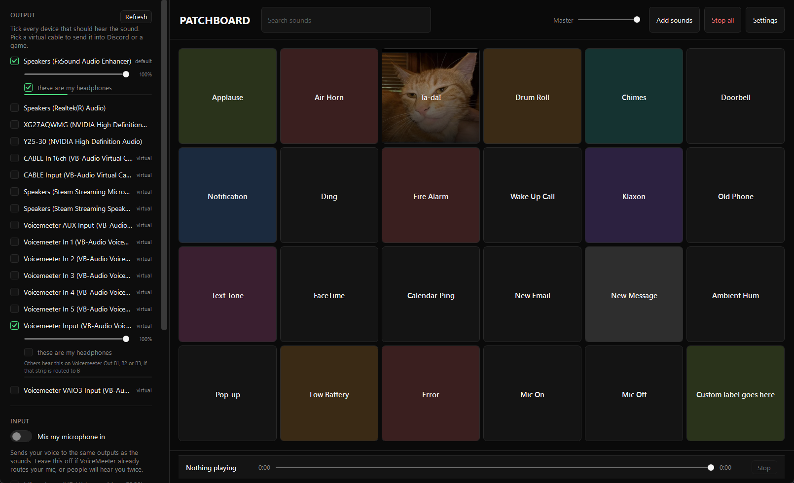

# Patchboard

A Windows soundboard that plays to several audio devices at once, so one click reaches your headphones **and** your voice chat.

## Install

**You need:** Windows 10 or later (64-bit). Nothing else to install for Patchboard itself: it is one file, no installer, no .NET needed.

**Want people in Discord to hear the sounds?** Then you also need a free virtual audio cable (step 3). Skip step 3 if you only want to hear the sounds yourself.

1. **Download `Patchboard.exe`** from the [latest release](https://github.com/SamuelNDCE/Patchboard/releases/latest) (about 65 MB).
2. **Put it in a folder you will keep**, like `Documents\Patchboard`, and double-click it. There is nothing to install.
   - Windows may show a blue "Windows protected your PC" box, because the app is not code-signed. Click **More info**, then **Run anyway**.
3. **Install a virtual cable** (this is what carries the sound into Discord):
   1. Go to [vb-audio.com/Cable](https://vb-audio.com/Cable/) and download the driver pack (a `.zip`).
   2. Extract **all** the files from the zip.
   3. Right-click the setup program (`VBCABLE_Setup_x64.exe` on a 64-bit PC) and choose **Run as administrator**.
   4. **Restart your PC.** The cable does not appear until you do.
4. **Open Patchboard again.** On first launch it picks a route for you: your normal speakers or headphones so you hear the sounds, plus the cable so others do. Look at the **OUTPUT** panel on the left and check both are ticked.
5. **Point Discord at the cable.** Discord, User Settings, Voice & Video, **Input Device**, and choose **CABLE Output (VB-Audio Virtual Cable)**.
6. **Add sounds.** Drag audio files onto the window, or press **Add sounds**. Click a button to play it. Click again to stop.

You are done. Ask a friend to listen, or watch Discord's input meter move when you click a button.

### If something is wrong

| What you see | What it means | Fix |
|:---|:---|:---|
| Amber banner: "No virtual cable selected" | Sound only reaches you, nobody else | Press **Add a cable** in the banner. If it finds nothing, the cable is not installed yet, or you have not restarted since installing it (step 3) |
| Friends hear nothing, you hear the sound fine | Discord is still listening to your real microphone | Redo step 5: the Input Device must be **CABLE Output** |
| Friends hear the sound but not your voice | Your voice is not going into the cable | Turn on **microphone passthrough** for the cable in Patchboard's OUTPUT panel (it is off by default) |
| You hear an echo or feedback | Your routing loops sound back into itself | Patchboard warns when it sees this. Untick the output it names |
| You use push to talk and the first word is cut off | The channel is not open yet when the clip starts | Set **Delay before playing** in Settings, and hold your talk key while the clip plays |
| Several sounds are overlapping | Each click starts a new sound | Press **Stop all** |

The first two rows cover nearly every "it does not work" report: Patchboard plays into the cable, and Discord has to be listening to it.

## About

Built because most soundboards play to exactly one output. That is the wrong shape for the job:
you want to hear the sound yourself *and* have it arrive in Discord, and on a machine with a
capture card or a second mic you may want it in more places than that. Patchboard decodes a clip
once and fans the same audio out to every device you tick.

This started as a personal project to replace a soundboard that had stopped working right on
my own machine, and it's shared here in case it's useful to anyone else who wants one. It's a
single self-contained executable, no installer, no background service, no telemetry, and it's
open source under MIT, so you can read every line it runs.

## Why you need a virtual cable

**A soundboard cannot put sound into Discord on its own.** Windows has no way for an app to
"speak into" your microphone. What actually happens is:

```
Patchboard  ->  a virtual audio cable  ->  Discord listens to that cable as its microphone
```

So you need a virtual cable installed, and you need the voice app pointed at it. Without one,
Patchboard plays to your speakers and nobody else hears a thing. That failure is silent and looks
exactly like the app working, which is why Patchboard warns about it explicitly and offers to fix
the routing in one click.

VB-Cable is free. [VoiceMeeter](https://vb-audio.com/Voicemeeter/), a full mixer, also works if you want more control, with more setup. Patchboard does not install either for you, because they install an audio driver, which an app should not do silently.

## If you use push to talk

Your sounds will not transmit unless the channel is open, so hold your talk key while the clip plays. Settings has a **Delay before playing** so the clip starts after the channel opens rather than losing its first word, and any single sound can override that.

## What it does



Every button on that grid is renamed, coloured, and one has its own picture, all through the
right-click menu. None of that is fixed: every label, colour, image, and its position in the
grid is yours to set, on every button, at any time. Nothing shown here ships with the app;
you start from an empty board and build your own.

**Output**

- Play to any number of devices at once, each with its own volume
- Mark one device as "my headphones" and preview a sound there only, so you can audition
  something without sending it to everyone
- Optional microphone passthrough, per output device, off by default
- A **Mute mic** panic button, and a warning when your routing would create a feedback loop
- A master volume slider on top of every per-sound and per-device volume
- **Stop all**, one click, if several sounds are overlapping and you need silence now

**Customising a button** (right-click it)

- **Rename** it to whatever you want; nothing here is a fixed label
- **Colour**, eight built-in tints, purely to help you find a button at a glance
- **Image**, any picture you have, filling the tile with the label over it

**Finding a button**

- **Drag to reorder**, anywhere on the grid
- **Search**, the box at the top of the grid, for when the board has more sounds than fit
  on screen

**Sounds**

- `.mp3` `.wav` `.ogg` `.flac` `.m4a` `.aac` `.wma` `.aiff` `.aif`
- Per-sound volume from 0 to 200%, so a quiet recording can be boosted
- Trim a clip to just the part you want, on a two-handle slider over its real length
- Any clip length. Long recordings stream from disk instead of being decoded into memory
- Seek through whatever is playing from the transport bar
- Global hotkeys that still fire while the window is minimised and a game has focus

**Library**

- Import a folder in bulk
- Tidy up labels, which strips the artefacts bulk downloads leave behind: `(1)` suffixes, ripper
  site prefixes, download ids, editor leftovers. It never touches a name you wrote yourself
- Find duplicates, confirmed by content hash rather than file size
- Remove buttons whose file has gone

## Settings

| Setting | What it does |
|---|---|
| Columns / Rows visible | Grid size. Anything past the visible rows scrolls, so no sound is hidden |
| Audio buffer | WASAPI buffer, 20 to 500 ms. Lower is snappier, too low crackles under load |
| Delay before playing | Lead-in before a clip starts, for push to talk. Any sound can override it |

Settings live in `%APPDATA%\Patchboard\config.json` and are written atomically on every change.
A corrupt file is moved aside rather than deleted, and the app still opens.

## Building from source

Needs the [.NET 9 SDK](https://dotnet.microsoft.com/download).

```
dotnet build src/Patchboard/Patchboard.csproj -c Release
```

Release build, one self-contained file:

```
dotnet publish src/Patchboard/Patchboard.csproj -p:PublishProfile=win-x64 -o publish
```

### Checks

```
dotnet run --project tests/Patchboard.Checks
```

A console harness rather than a unit test framework, because most of what is worth checking here
is real audio behaviour: decoding, resampling, the mixer, opening actual WASAPI endpoints,
capture, routing safety, and settings surviving a round trip.

Two things to know before running it:

- **It writes your real `config.json`** in a few places and restores it afterwards. It keeps a
  rescue copy on disk while it does, but killing the run at the wrong moment can still cost you
  your library. Back it up first if it matters.
- It opens live audio devices. It only ever targets endpoints that are inert on the development
  machine, so on yours it may open something you can hear.

## How it works

- **NAudio 3.0.1**, WASAPI in shared mode. Exclusive mode would seize the endpoint and cut off
  the game and the voice app
- One output channel per selected device, each holding its own mixer and stream open for the
  life of the selection. Opening a WASAPI stream costs tens of milliseconds, which on a
  soundboard is the difference between landing a joke and missing it
- Everything is converted to one canonical format, 48 kHz stereo float, before it reaches a mixer
- A clip is decoded once and shared. Each device gets a cheap reader over the same array, so the
  outputs cannot drift apart
- Clips under two minutes stay in memory under a 256 MB budget, least recently used evicted
  first. Longer ones stream from disk, which is what removes any length limit
- Decoding happens off the UI thread. Global hotkeys use `RegisterHotKey` rather than a
  low-level keyboard hook, deliberately: a hook sits in the input path of every keystroke on the
  machine and is the exact signature anti-cheat looks for

## Licence

MIT. See [LICENSE](LICENSE).

NAudio is MIT licensed.
